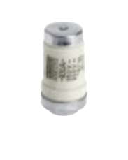
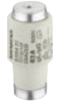
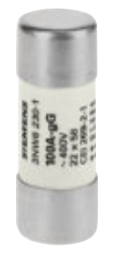
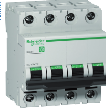
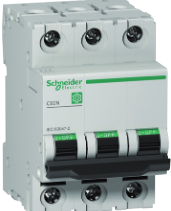
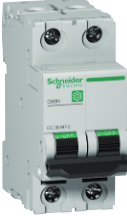
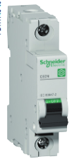
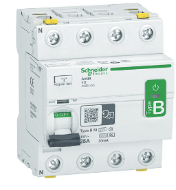
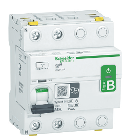

# Trabajo Juan

## fusibles

|   Tipos    |  Marca  |  Modelo   | Categoria | In | Referencia |     tension      | Precio |                           Imagen                           |
| :--------: | :-----: | :-------: | :-------: | :-----------: | :--------: | :--------------: | :----: | :--------------------------------------------------------: |
|   NEOZED   | Siemens |    D03    |    gG     |      80A      |  5SE2 280  | 400V AC/250V DC  |   6€   |                                |
|   DIAZED   | Siemens |    DIV    |    gG     |     100A      |  5SC2 21   | 500V AC/ 400V DC |  8,5€  |                              |
| Cilindrico | Siemens |           |    gG     |     100A      | 3NW6 230-1 |     400V AC      | 20€x2  |                          |
|     NH     | Siemens | 2(Tamaño) |    gG     |     400A      | 3NA6 260-4 |     400V AC      | 31,7€  |  |

---

## Magnetermicos

| Tipos | Marca | Modelo | Curve | In | Referencia | &nbsp;&nbsp;&nbsp;tension&nbsp;&nbsp;&nbsp; | Precio | Imagen |

- [ ] | :----: | :-------: | :-----: | :---: | :-----------: | :--------: | :-----------------------------------------: | :----: | :-------------------: |
      | 4 pole | Schneider | C60N 4P | C | 63A | M9F11463 | 440V | 255€ |  |
      | 3 pole | Schneider | C60N 3P | C | 63A | M9F11363 | 415V | 253€ |  |
      | 2 pole | Schneider | C60N 2P | C | 20A | M9F11220 | 240V | 76€ |  |
      | 1 pole | Schneider | C60N 1P | C | 16A | M9F11116 | 240V | 25€ |  |

> Los magnetotérmicos se distribuyen en 4 formatos según la cantidad de polos (1, 2, 3, 4). Según el uso que se les vaya a dar, ya sea en un hogar o en la industria, vamos a encontrar modelos con distintos amperajes y capacidades de corte. En un hogar se usarán principalmente de dos polos debido a su menor precio y mayor conveniencia para instalaciones monofásicas, y en una industria habrá que diseñar las protecciones necesarias dependiendo del uso que se les vaya a dar, teniendo así dentro de una misma instalación magnetotérmicos de 1, 2, 3 y 4 polos. Los magnetotérmicos protegen contra sobrecargas y sobreintensidades.

 

---

## Diferenciales

| Tipos  |   Marca   | Modelo | Categoria | In | Referencia | tension | Precio |         Imagen         |
| :----: | :-------: | :----: | :-------: | :-----------: | :--------: | :-----: | :----: | :--------------------: |
| 4 pole | Schneider |  iID   | Tipo B-SI |      80A      |  A9Z66480  |  400V   | 5.613€ |   |
| 2 pole | Schneider |  iID   | Tipo B-SI |      25A      |  A9Z61225  |  230V   | 1.490€ |  |

> Los diferenciales, a diferencia de los magnetotérmicos, se distribuyen en dos únicos formatos: diferenciales de 2 polos (L1+N) y de 4 polos (L1+L2+L3+N). Al igual que los magnetotérmicos, se pueden encontrar diferenciales en el mercado para distintos usos, ya sea en el hogar o en la industria, y varían tanto en intensidad nominal, tensión nominal, poder de corte y sensibilidad de disparo. Los diferenciales protegen contra corrientes de fuga.

Daniel Carbajales Soto
