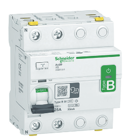

# Diferenciales

| Tipos  |   Marca   |  Modelo   | Categoria | In | Referencia | tension |         Imagen         |
| :----: | :-------: | :-------: | :-------: | :-----------: | :--------: | :-----: | :--------------------: |
| 4 pole | Schneider | Acti9 iID | Tipo B-SI |      80A      |  A9Z66480  |  400V   |   |
| 2 pole | Schneider | Acti9 iID | Tipo B-SI |      25A      |  A9Z61225  |  230V   |  |

> Los diferenciales a diferencia de los magnetotermicos son distribuidos en dos unicos formatos, diferenciales de 2 polos(L1+N) y de 4 polos(L1+L2+L3+N). al igual que los magnetotermicos se pueden encontrar diferenciales en el mercado para distintos usos sea en el hogar o en la industria y varian tanto en intensidad nominal, tensión nominal, poder de corte y sensibilidad de disparo.
